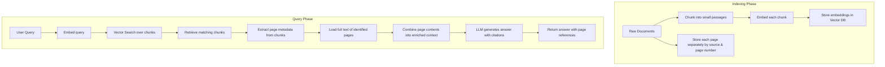

# Hybrid RAG Implementation

Triển khai chiến lược RAG Hybrid kết hợp ưu điểm của chunk-based retrieval và full document context.

## Chiến lược Hybrid RAG với Page-based Retrieval



## Ưu điểm của Hybrid RAG với Page-based Approach

1. **Độ chính xác cao**: Vector search trên chunks nhỏ giúp tìm thông tin liên quan chính xác
2. **Ngữ cảnh đầy đủ**: Sử dụng full text của từng page để cung cấp ngữ cảnh hoàn chỉnh
3. **Tránh mất thông tin**: Không bị giới hạn bởi kích thước chunks khi tạo câu trả lời
4. **Hiệu quả**: Chỉ tải full text của các pages có chunks liên quan
5. **Citations tự động**: Tự động tạo citations với thông tin trang cụ thể
6. **Truy xuất nguồn**: Dễ dàng truy xuất lại nguồn gốc thông tin

## Cách thức hoạt động Page-based Retrieval

### Indexing Phase:
1. **Lưu trữ từng page**: Mỗi page được lưu riêng biệt theo cấu trúc `{source: {page_num: {page_content, metadata}}}`
2. **Chunk embedding**: Chunks được embed vào vector database với metadata page đầy đủ
3. **Liên kết metadata**: Mỗi chunk chứa thông tin về source và page number gốc

### Retrieval Phase:
1. **Vector search**: Tìm chunks liên quan nhất với query
2. **Page identification**: Từ metadata của chunks, xác định các pages cần thiết
3. **Full page loading**: Tải full text của các pages được xác định
4. **Context building**: Kết hợp full page content với thông tin chunks
5. **Citation generation**: Tự động tạo citations theo format `[filename, trang X]`

### Ví dụ Output với Citations:
```
Theo tài liệu, phương pháp này được đề xuất để cải thiện hiệu suất của hệ thống RAG [2506.21538v1.pdf, trang 3]. 
Kết quả thực nghiệm cho thấy độ chính xác tăng 15% so với phương pháp truyền thống [2506.21538v1.pdf, trang 8].

Nguồn tham khảo:
- [2506.21538v1.pdf, trang 3]
- [2506.21538v1.pdf, trang 8]
```

## Files

### 1. `index_hybrid.py`
**Chức năng**: Indexing documents cho hybrid RAG
- Chia documents thành chunks và lưu vào vector database
- Lưu trữ full documents riêng biệt trong `document_store.json`
- Tạo metadata liên kết giữa chunks và source documents

**Cách sử dụng**:
```bash
cd RAG
python index_hybrid.py
```

### 2. `gen_answer_hybrid.py`
**Chức năng**: Tạo câu trả lời sử dụng hybrid retrieval strategy
- Tìm kiếm chunks liên quan qua vector search
- Xác định source documents từ chunks tìm được
- Tải full documents tương ứng
- Kết hợp thông tin để tạo context phong phú cho LLM

**Cách sử dụng**:
```bash
cd RAG
python gen_answer_hybrid.py
```

## Quy trình sử dụng

### Bước 1: Chuẩn bị môi trường
```bash
# Cài đặt dependencies
pip install -r requirements.txt

# Khởi động Qdrant vector database
cd ../vectordb
docker-compose up -d
```

### Bước 2: Indexing documents
```bash
cd ../RAG
python index_hybrid.py
```

Quá trình này sẽ:
- Đọc PDF từ đường dẫn được chỉ định
- Chia thành chunks và embed vào vector database
- Lưu full documents vào `document_store.json`

### Bước 3: Sử dụng chatbot
```bash
python gen_answer_hybrid.py
```

## Cấu hình

### Trong `index_hybrid.py`:
```python
# Thay đổi đường dẫn PDF
pdf_path = "/path/to/your/document.pdf"

# Cấu hình chunk size
chunk_size = 400
chunk_overlap = 80

# Tên collection
collection_name = "hybrid_rag_collection"
```

### Trong `gen_answer_hybrid.py`:
```python
# Cấu hình retrieval
search_kwargs = {"k": 5}  # Số chunks tìm kiếm

# Model configuration
model = "gpt-4o-mini"
temperature = 0.1
```

## Hybrid Retrieval Process

1. **Vector Search**: Tìm kiếm chunks liên quan nhất với query
2. **Source Identification**: Xác định source documents từ chunks
3. **Document Loading**: Tải full documents tương ứng
4. **Context Building**: Kết hợp full documents + relevant chunks
5. **Answer Generation**: LLM tạo câu trả lời với context đầy đủ

## Debug và Monitoring

Hệ thống cung cấp thông tin chi tiết về quá trình retrieval:

```
=== HYBRID RETRIEVAL PROCESS ===
Bước 1 - Tìm thấy 3 chunks liên quan:
  1. Score: 0.8234 - This paper presents a novel approach...
  2. Score: 0.7891 - The methodology involves...
  3. Score: 0.7654 - Results show that...

Bước 2 - Xác định 1 source documents: ['/path/to/document.pdf']
Bước 3 - Tải 15 full documents
=== GENERATING ANSWER ===
```

## So sánh với RAG truyền thống

| Aspect | Traditional RAG | Hybrid RAG |
|--------|----------------|------------|
| Retrieval | Chỉ chunks | Chunks → Full docs |
| Context | Giới hạn | Đầy đủ |
| Accuracy | Cao cho thông tin cụ thể | Cao + ngữ cảnh rộng |
| Performance | Nhanh | Chậm hơn nhưng chất lượng cao |
| Memory | Ít | Nhiều hơn |

## Troubleshooting

### Lỗi "Vector store có vẻ trống"
```bash
# Chạy lại indexing
python index_hybrid.py
```

### Lỗi "Không tìm thấy document_store.json"
```bash
# File này được tạo tự động khi chạy index_hybrid.py
python index_hybrid.py
```

### Lỗi kết nối Qdrant
```bash
# Kiểm tra Qdrant đang chạy
cd ../vectordb
docker-compose ps

# Khởi động lại nếu cần
docker-compose restart
```

## Tùy chỉnh nâng cao

### Thay đổi chiến lược context building
Trong `gen_answer_hybrid.py`, method `_hybrid_retrieve_and_format()`:

```python
# Giới hạn độ dài content
if len(content) > 3000:
    content = content[:3000] + "..."

# Số chunks liên quan hiển thị
for i, chunk_content in enumerate(relevant_chunks[:2]):
```

### Cải thiện ranking
```python
# Sắp xếp theo độ liên quan
context_parts.sort(key=lambda x: x[0], reverse=True)

# Có thể thêm weighted scoring
weighted_score = avg_score * relevance_weight
```

## Performance Tips

1. **Chunk Size**: Chunks nhỏ (400-800 chars) cho độ chính xác cao
2. **Overlap**: 15-20% overlap để tránh mất thông tin
3. **K Value**: 3-7 chunks cho balance giữa chất lượng và tốc độ
4. **Content Limit**: Giới hạn full document content để tránh vượt token limit

## Kết luận

Hybrid RAG cung cấp giải pháp cân bằng giữa độ chính xác của chunk-based retrieval và sự phong phú của full document context, phù hợp cho các ứng dụng yêu cầu câu trả lời chi tiết và có ngữ cảnh đầy đủ.
